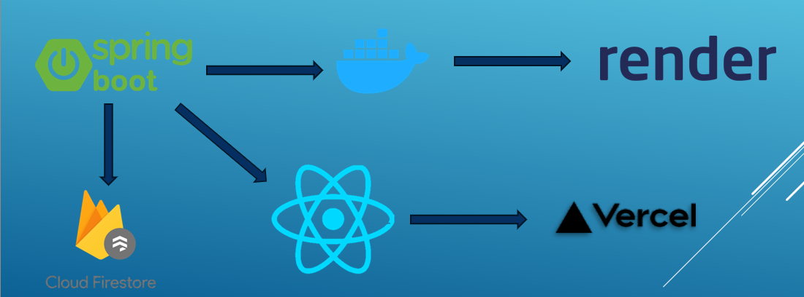

# JobFinder 💼

## Kazalo vsebine 📚

- O projektu
- Funkcionalnosti
- Dodatne funkcionalnosti
- Tehnološki sklad
- Namestitev
  - Frontend
  - Backend
- Avtor
- Povratne informacije

## O projektu 🌐

JobFinder je spletna aplikacija, ki uporabnikom (delodajalcem in delojemalcem) ponuja interaktiven in zanimiv način za iskanje oziroma ponujanje službe. Preprosto ustvarite svoj račun, nanj dodajte svoje osnovne informacije, kompetence, CV in drugo, kar vam bo pomagalo pri pridobivanju zaposlitve ali kaj služba ponuja, če kot delodajalec iščete nov delovni kader!

**V repozitoriju se nahaja mapica z imenom _PROMOCIJA v kateri najdete posnetke zaslona, video demonstracijo uporabe aplikacije in drugo.**

## Funkcionalnosti 🚀

- **Profil delojemalca**:
  - 👤 Ime
  - 🖼️ Slika
  - 📜 Kompetence
  - 📧 Elektronski naslov
  - 🎂 Starost
  - 📝 Bio

- **Ponudbe za delo**:
  - 🏷️ Naziv
  - 📧 Elektronski naslov
  - 📞 Kontaktna številka
  - ✍️ Kratek opis
  - 📜 Potrebne kompetence
  - 💰 Plača
  - ℹ️ Druge potrebne informacije

- **Ujemanje**: 
  - 💬 Če oba, delojemalec in delodajalec, izbereta 'like', se jima odpre chat za nadaljnjo komunikacijo.

## Dodatne funkcionalnosti (v načrtu) 🛠️

- 🕵️‍♂️ Filtriranje glede na tip službe, regijo
- 📍 Prioritetni prikaz služb, ki se nahajajo bližje uporabniku/delodajalcu
- ⭐ Ocenjevanje uporabnikov (graf na profilu)
- 🔗 Povezovanje z GitHub ali LinkedIn profilom
- 🗺️ Zemljevid, kjer se prikažejo vsi profili, s katerimi se uporabnik ujema
- 💳 Plačilna verzija, ki bi omogočala:
    - 🔄 Vračanje na prejšno kartico po izbiri like/dislike
    - ❤️ Posebni like, ki bi se ne glede na odločitev drugega uporabnika njemu sporočil
- 📧 Obveščanje o ujemanju preko elektronskega naslova
- 📄 Odpiranje podrobnosti profila delojemalca, ki bi prikazalo tudi CV
- 📅 Povezava z Google Meet koledarjem, na katerega bi se lahko dodali razgovori za službo v chat-u dveh ujemanih posameznikov

## Tehnološki sklad 🛠️

<table style="border-collapse: collapse; width: 100%; border: none;">
  <tr>
    <td style="vertical-align: top; padding-right: 20px; border: none;">
      React <br/>
      SpringBoot <br/>
      Firestore <br/>
      Render <br/>
      Vercel <br/>
      Docker <br/>
    </td>
    <td style="vertical-align: top; border: none;">
      
    </td>
  </tr>
</table>


## Namestitev ⚙️

Ta projekt je razdeljen na frontend in backend. Za namestitev in zagon obeh delov sledite spodnjim navodilom.

### Frontend 💻

1. Pojdite v mapo `frontend`:
   ```sh
   cd frontend

2. Namestite potrebne odvisnosti:
    ```sh
    npm install

3. Zaženite aplikacijo:
    ```sh
    npm run dev

To bo zagnalo razvojni strežnik React in odprlo aplikacijo v vaš privzeti brskalnik na naslovu http://localhost:5173.

### Backend 🖥️

Priporočena uporaba XAMPP, saj Springboot potrebuje Tomcat strežnik

1. Pojdite v mapo `backend`:
   ```sh
   cd backendend

2. Namestite potrebne odvisnosti
    ```sh
    npm install

3. Zaženite strežnik
    ```sh
    npm start

To bo zagnalo vaš Springboot strežnik na naslovu http://localhost:8080.

## Avtor ✍️

- [Nik Tišler](https://github.com/FallenBanana200)

## Povratne informacije 📬

Če imate kakršnekoli predloge ali težave, prosimo, odprite težavo na [GitHub Issues](https://github.com/FallenBanana200/JobFinder/issues).

Za dodatno pomoč me lahko kontaktirate tudi na naslednjem naslovu:

- 📧 [nik.tisler1@student.um.si](mailto:nik.tisler@student.um.si)
